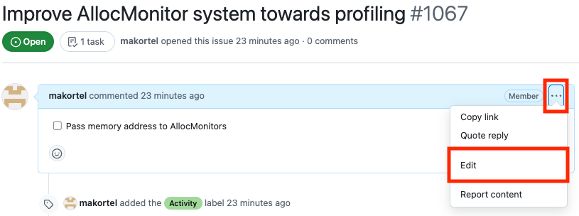
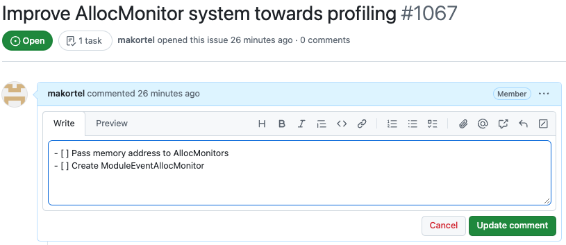
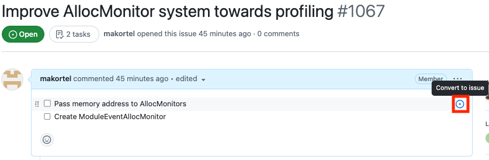

# Updating the plan of an activity

## Add new task(s) in the list

Edit the issue description

----

Add new task(s) to the task list

## Convert task(s) into Task issue(s)

A task needs to be converted into a Task issue at the latest when the work on the task begins. The conversion can be done as early in the process that seems reasonable (e.g. at the time the work on the Activity begins). It is just that editing the plan is typically easier with the task list than when the Task issues have already been created.

The conversion is done by hovering the mouse cursor over the task list item, and clicking the bullseye icon

## Add existing issues as tasks

An alternative to adding new tasks in the list and converting the tasks into task issues is to directly add an existing Task issue into the task list.
