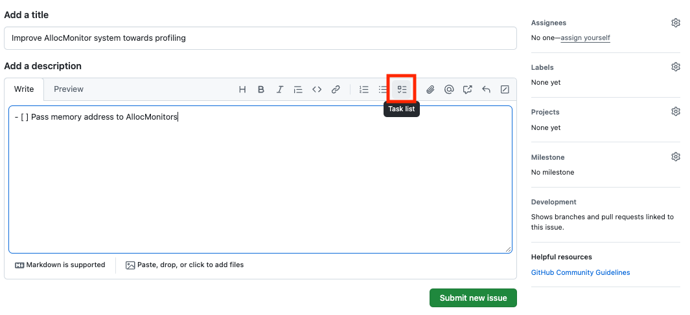
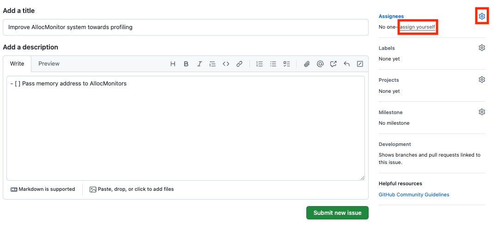
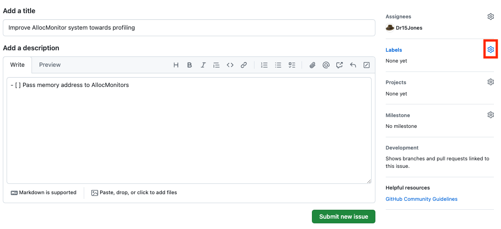
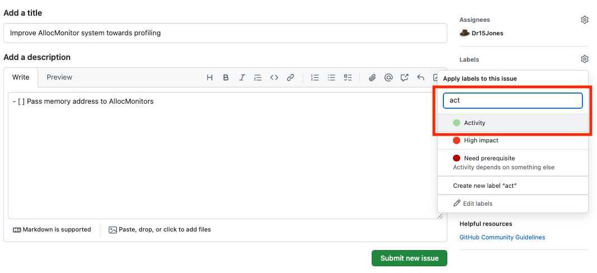
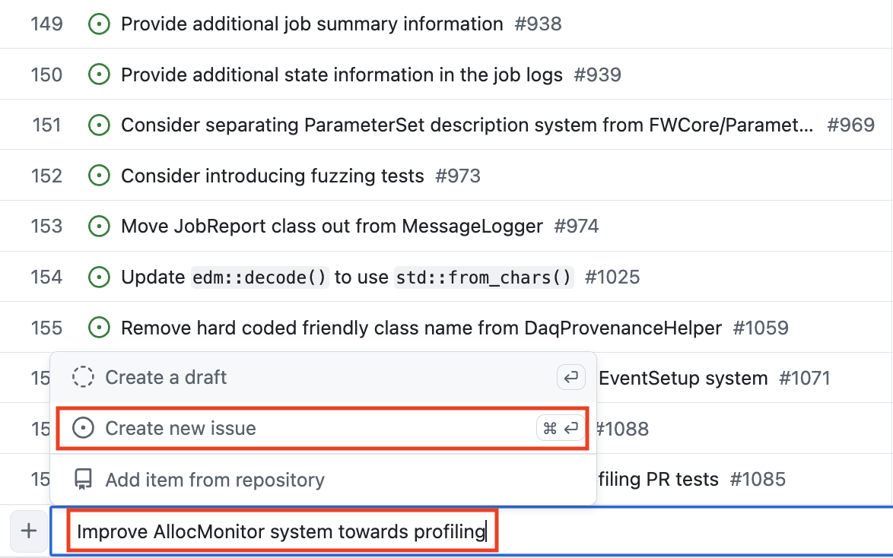

# Creating new activity

## Create a new issue directly

E.g. follow [this link](https://github.com/cms-sw/framework-team/issues/new). Fill the title, and a short description if necessary. If there is a corresponding CMSSW issue, include a link to it in the issue description (in this case no additional content is necessary, i.e. the link alone is fine; you can also use the same title for the issue).

If it makes sense to create an initial plan for an activity, do that by including a task list, with one element for each task

----

The activity can be assigned to a developer already at the creation phase. There is a quick link to assign the activity to yourself.

----

Add the `Activity` label for the issue

Then click `Submit new issue`. GitHub will automatically add the new issue to the [Activities project](https://github.com/orgs/cms-sw/projects/11).

----

## Create a new issue via the project board

The issue can also be created through the [Activities project](https://github.com/orgs/cms-sw/projects/11). For example, in the [`By importance` view](https://github.com/orgs/cms-sw/projects/11/views/2), start writing the the title of the issue, and then click `Create new issue`

