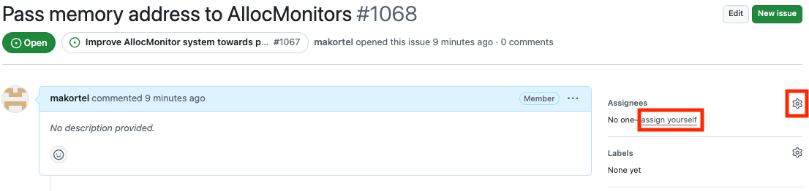
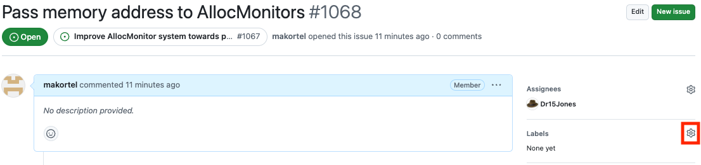
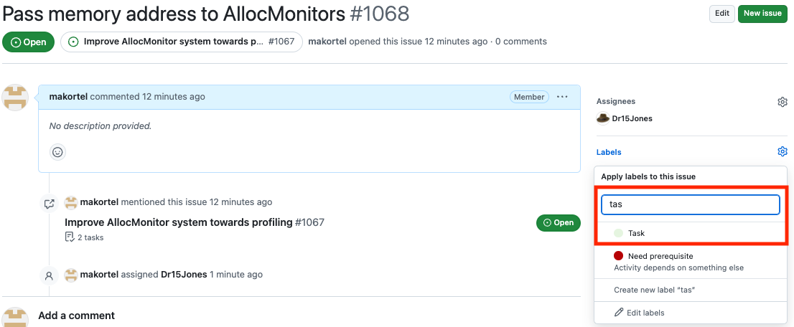
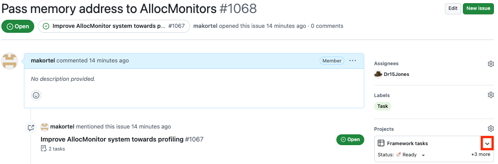
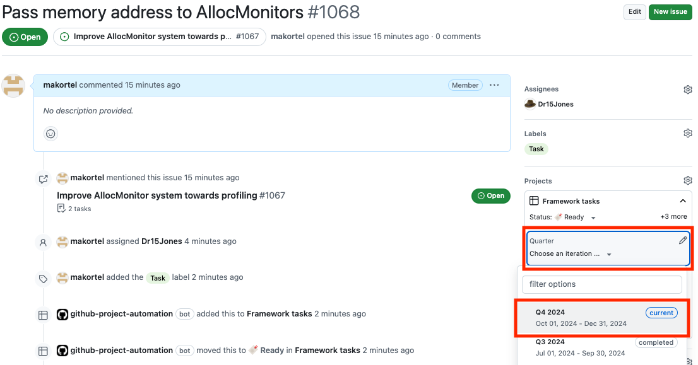
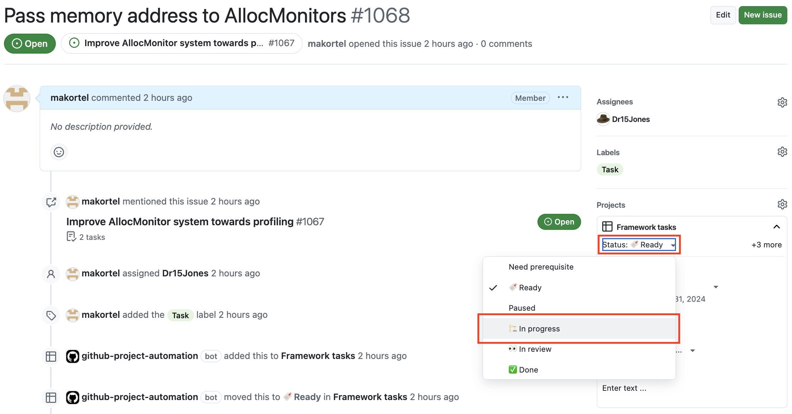

# Starting to work on a Task

A Task needs to be part of an Activity (via being in the Activity issue's task list), or Maintenance or Documentation (marked as labels).

Assign issue to who will be working on it (can be yourself)

----

Add the `Task` label for the issue

GitHub will then add the Task issue to the [Tasks project](https://github.com/orgs/cms-sw/projects/10). You may need to refresh the web page.

----

Expand the project section

----

Select the quarter the Task issue is being worked on (nearly always the current quarter)

For Tasks that are part of an Activity do **not** set the week.

---

Change the status to `In progress`.

