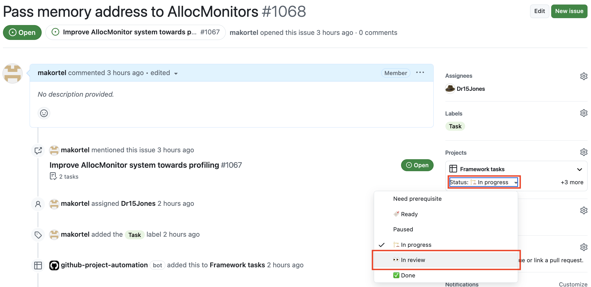
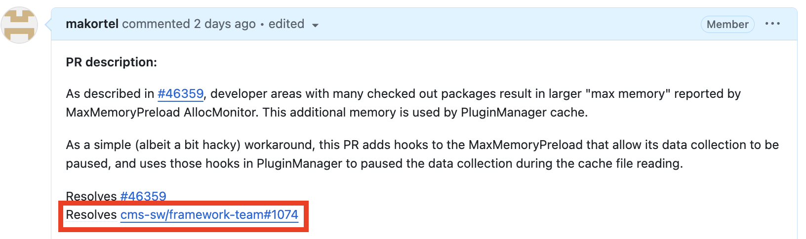

# Finalizing an existing Task

## Task results a Pull Request

When the task results a Pull Request, after you have opened the PR, change the status of the Task issue to `In Review`.




### PR is in repository under `cms-sw` organization, e.g. CMSSW

If the task results a PR in `cms-sw` organization, e.g. CMSSW, connect the PR and the Task issue by including e.g.
```
Resolves https://github.com/cms-sw/framework-team/issues/1030
```
to the CMSSW PR **description**. Then, when the CMSSW PR is merged, the Task issue is automatically closed. The connection is also visible in the project boards. GitHub recognizes also other keywords for the creation of this connection, see [here](https://docs.github.com/en/issues/tracking-your-work-with-issues/using-issues/linking-a-pull-request-to-an-issue) for more details.




Note that the automatic closure works only if the PR is to the default branch of the repository (e.g. `master` in case of CMSSW). This means that bookkeeping the status of backport PRs needs to be done manually.

### PR is to a repository in some other organization

Add a link to the PR to the Task issue description. The Task issue needs to be closed manually after the PR has been merged (either in the 

## Task was something else than a PR

Close the Task issue when the work is finished.

## What if the Task issue was the last Task of an Activity?

When the last Task issue of an Activity is closed, close also the Activity issue. The closure of the Activity issue is not critical though (i.e. forgetting to do is ok in practice), because the manager should go over open Activities at least once a week.
