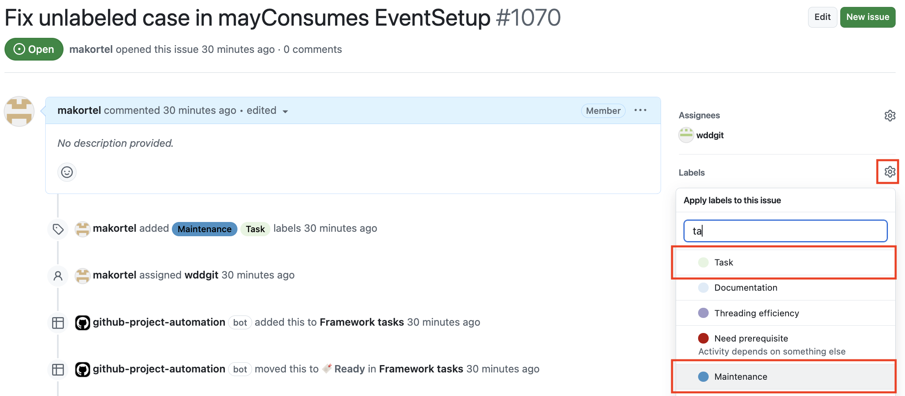
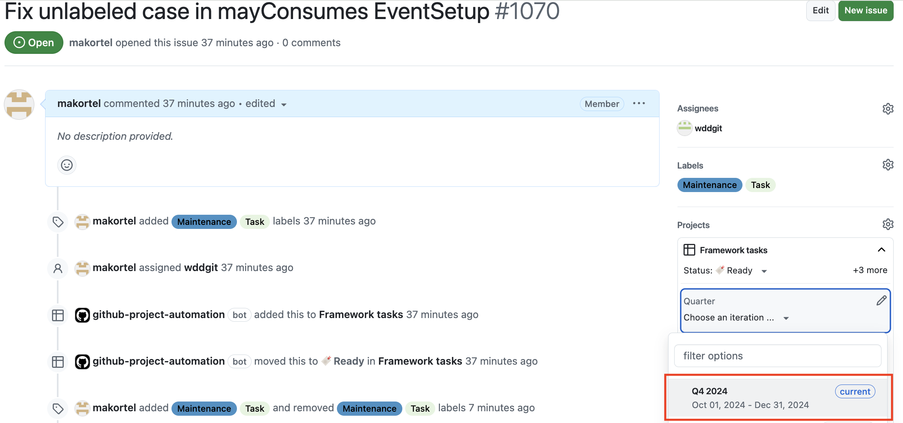
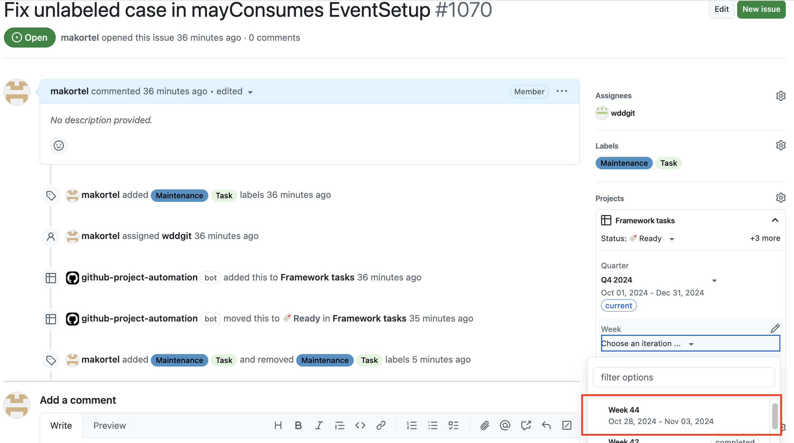
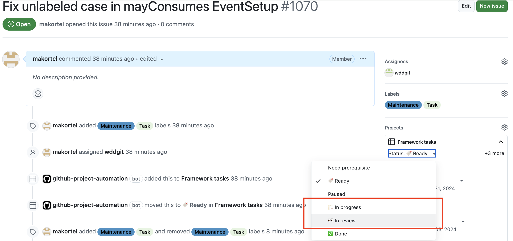

# Maintenance fix or documentation update

Tasks that are maintenance or documentation are not part of any Activity issue. Instead, they are just Task issues (i.e. have `Task` label) that have either `Maintenance` or `Documentation` labels. 

Open a Task issue as described [here](Task_begin.md). Set the label `Maintenance` or `Documentation` in addition of the `Task` label.

----

Select the quarter the Task issue is being worked on (nearly always the current quarter)

----

Select the week of the Task issue was or is planned to the completed. Completion means opening a PR (`Maintenance`) or finishing the documentation update (`Documentation`). In most cases the week should be the current week, because these Tasks should not cross the week boundary. If such crossing nevertheless happens, the previous week (e.g. recording past on Monday) or next week (starting something on late Friday that gets completed on the following week) can be used.

----

Set the status of the Task issue to either `In progress` (if you just started working on the task) or to `In review` (if you already opened the PR; in this case remember the edit the PR description by adding `Resolves <URL to Task issue>` as described [here](Task_finish.md))

